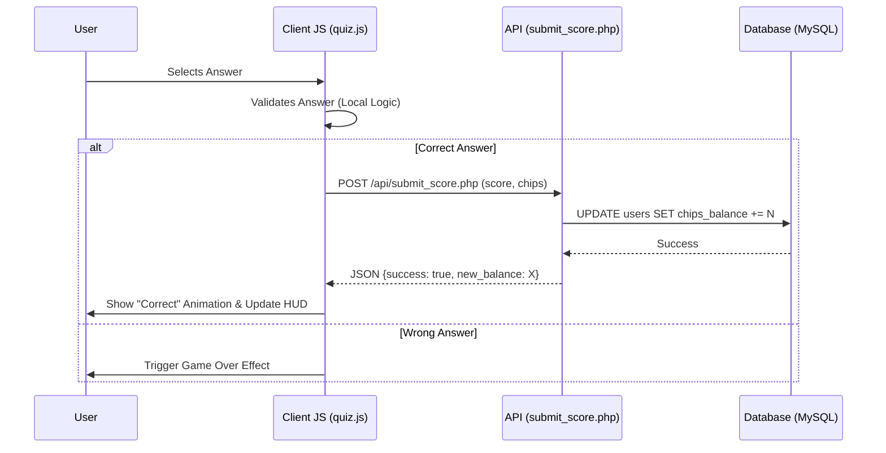
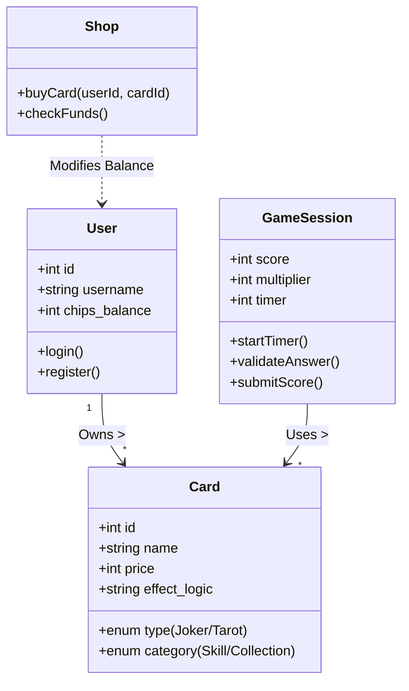
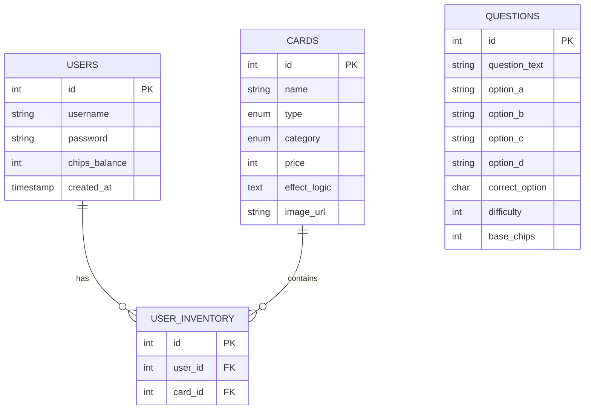

# System Architecture

## 1. System Flowchart

This flowchart illustrates the user journey through the application, from Login to the core Game Loop.

```mermaid
flowchart TD
    A[Start] --> B{Has Account?}
    B -- No --> C[Register]
    B -- Yes --> D[Login]
    C --> D
    D --> E[Home Dashboard]

    E --> F[Play Protocol (Quiz)]
    E --> G[Shop]
    E --> H[Collection]
    E --> I[Wiki / Profile]

    F --> J{Answer Question}
    J -- Correct --> K[Earn Chips]
    J -- Wrong --> L[Game Over]

    K --> M{Next Question?}
    M -- Yes --> J
    M -- No --> N[Win Round]

    N --> E
    L --> E

    G --> O{Buy Card?}
    O -- Yes --> P[Deduct Chips & Add to Inventory]
    P --> G

    H --> E
```

## 2. Sequence Diagram: Quiz & Score Submission

This diagram details the interaction between the Client (Browser), the Server (PHP API), and the Database when a user answers a question.



## 3. Class Diagram (Conceptual)

Although the system uses procedural PHP, the logic mimics an Object-Oriented structure through separate modules.



## 4. Entity Relationship Diagram (ERD)

The database schema structure and relationships.


